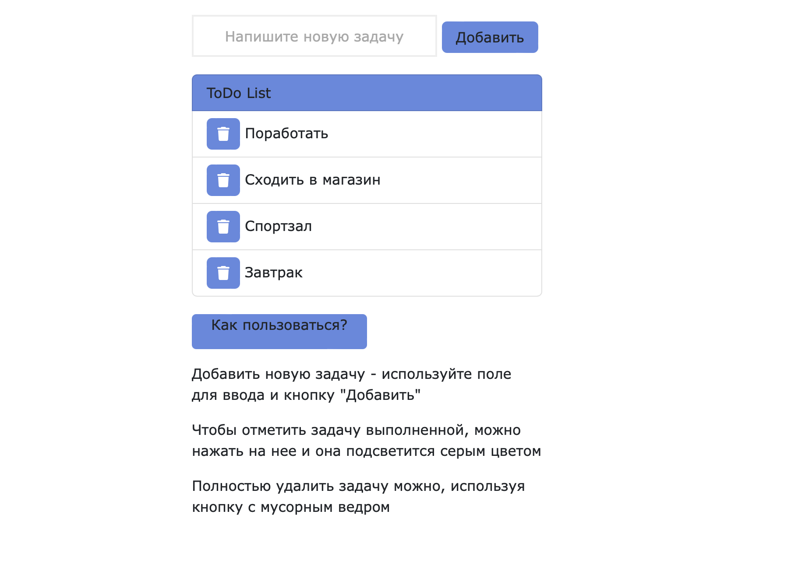

# ToDo_list

[Посмотреть todo](https://unnastasya.github.io/ToDo_list/)
***
При открытии страницы с ToDo list мы по дефолту получаем несколько задач, которые можно удалить.
 
Чтобы добавить новую задачу, нужно ввести свою задачу в поле и нажать кнопку "Добавить"
 
 
При наведении на задачу Вы увидите, что она подсвечивается голубым цветом
 
Если нажать на эту задачу, то можно сделать ее "неактивной" - она подсветится серым цветом
 
Чтобы удалить задачу, нужно нажать на кнопку с изображением мусорного ведра
 

